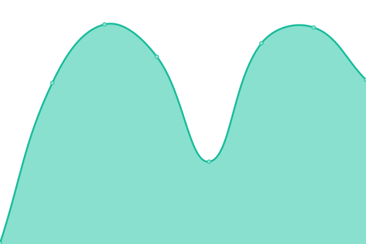

# [📈 Live Status](https://HvyD.github.io/UpTime_monitor): <!--live status--> **🟧 Partial outage**

This repository contains the open-source [Upptime](https://upptime.js.org) monitoring and status page for [HvyDs_Networks](http://www.HvyD.us) and [MonkeyMommaCreations](https://www.monkeymommacreations.com), powered by [Upptime](https://github.com/upptime/upptime).

We use [Issues](https://github.com/HvyD/UpTime_monitor/issues) as incident reports, [Actions](https://github.com/HvyD/UpTime_monitor/actions) as uptime monitors, and [Pages](https://HvyD.github.io/UpTime_monitor) for the status page.

<!--start: status pages-->
<!-- This summary is generated by Upptime (https://github.com/upptime/upptime) -->
<!-- Do not edit this manually, your changes will be overwritten -->
<!-- prettier-ignore -->
| URL | Status | History | Response Time | Uptime |
| --- | ------ | ------- | ------------- | ------ |
|  [HvyD's Portfolio Site](http://www.hvyd.us) | 🟥 Down | [hvy-d-s-portfolio-site.yml](https://github.com/HvyD/UpTime_monitor/commits/HEAD/history/hvy-d-s-portfolio-site.yml) | 

 216ms
     
 | 

<a href="https://HvyD.github.io/UpTime_monitor/history/hvy-d-s-portfolio-site">100.00%</a>
    

|  [MonkeyMommaCreations Blog and Store Site](https://www.monkeymommacreations.com) | 🟩 Up | [monkey-momma-creations-blog-and-store-site.yml](https://github.com/HvyD/UpTime_monitor/commits/HEAD/history/monkey-momma-creations-blog-and-store-site.yml) | 

 296ms
     
 | 

<a href="https://HvyD.github.io/UpTime_monitor/history/monkey-momma-creations-blog-and-store-site">100.00%</a>
    

<!--end: status pages-->

[**Visit our status website →**](https://HvyD.github.io/UpTime_monitor)

## 📄 License

- Powered by: [Upptime](https://github.com/upptime/upptime)
- Code: [MIT](./LICENSE) © [Scott W. Davis](http://www.HvyD.us)
- Data in the `./history` directory: [Open Database License](https://opendatacommons.org/licenses/odbl/1-0/)
